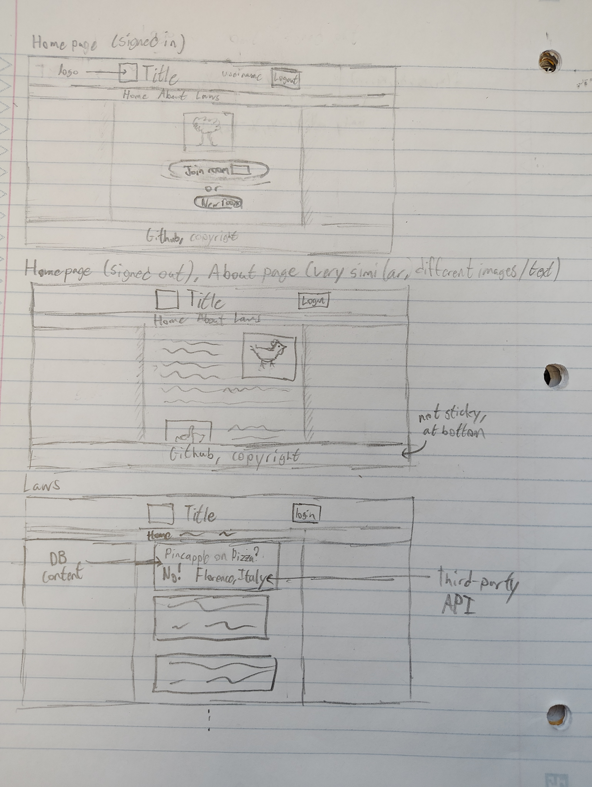
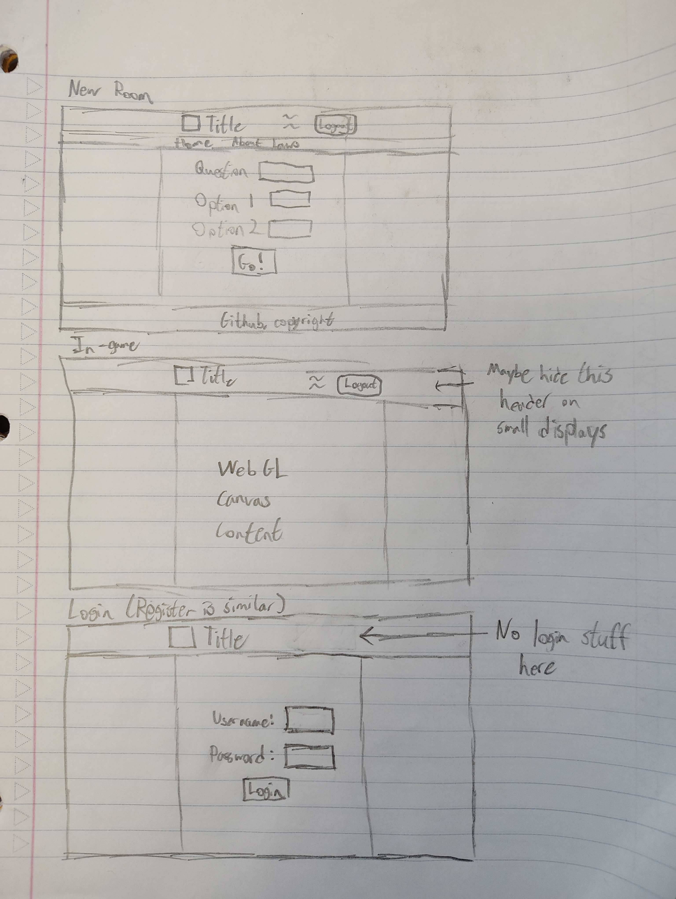

# The Law of the Jungle

[My Notes](notes.md)

A game about some very opinionated monkeys.
The core gameplay is relatively simple: throw bananas at the other team, while avoiding getting hit yourself.
Each game has a question associated with it; the winning team determines the answer.
Users will be able to log in, create and join rooms, and view recent game results.

There will definitely be some technical challenges implementing this, such as synchronizing the game state between players and
the server, and determining which pairs of objects intersect in an efficient manner.
I understand that this is beyond the scope of what is required this class,
but I am somewhat familiar with all of the course technologies already.
I want to come away from this class having created something I can really be proud of
and will be a better demonstration of my skills in case I decide to use it in a portfolio someday.

## Project Structure

For the first few deliverables (before React is introduced), all of the relevant code for grading will be located in the `static_content` directory.
Until then, the other directories will contain ongoing work on the parts of the project I wanted to get started on early.

## Specification Deliverable

For this deliverable I did the following. I checked the box `[x]` and added a description for things I completed.

- [x] Proper use of Markdown
- [x] A concise and compelling elevator pitch
- [x] Description of key features
- [x] Description of how you will use each technology
- [x] One or more rough sketches of your application. Images must be embedded in this file using Markdown image references.

### Elevator pitch

One of the foundational pillars of any society is consensus. As we have transitioned into the information age,
it has become apparent that technology can assist us in establishing and stabilizing social consensus.
Some CS 260 apps I could mention rely on the will the masses to build this consensus, which some might argue to be the incorrect approach (not me though).
This app attempts to provide an alternative to digital democracy: some good old-fashioned might-makes-right autocracy, all in real time!
Users compete in the role of monkeys to establish their ideological dominance by throwing bananas at one another until they are the last one standing.
After the game is over, users can head over to the "new laws" tab to view a listing of all the recent decisions that have been made.

### Design

### Key features

- Users will be able to register, login, and logout.
- Users will be able to both create and join games.
- Users in the same game will be able to interact with one another in real-time.

### Technologies

I am going to use the required technologies in the following ways.

- **HTML** - HTML will be used to provide the proper page content and structure to support the application.
             The login, laws, create game, join game, and in-game pages will all require their own HTML content.
             The game will be rendered using a WebGL-enabled canvas element.
- **CSS** - CSS will be used to provide styling and animation for the content of the various pages in the site.
- **React** - React will help to pull out shared content from the various pages into reusable components.
              Additionally, React will be used to route users between the different pages
              in response to certain conditions, such as when a user logs in or joins a game.
              I will likely have to use react effects in order to continually redraw the game content
              in a way that plays nicely with the react framework.
- **Service** - A backend service will handle user authentication, 
                I also plan to use the [GeoPlugin](https://www.geoplugin.net) API to provide users 
                information about where their game was started in.
- **DB/Login** - A database will be used to store authentication information, as well as information about ongoing and finished games.
- **WebSocket** - As the game is being played, all clients will maintain a model of the game world around them, including positions of all nearby objects.
                  Additionally, the server will maintain its own "authoritative" model. WebSocket is used to synchronize the client models with the server model,
                  as well as informing the server of each individual user's actions.

## AWS deliverable

For this deliverable I did the following. I checked the box `[x]` and added a description for things I completed.

- [x] **Server deployed and accessible with custom domain name** - [My server link](https://startup.pizzasco.lol).

## HTML deliverable

For this deliverable I did the following. I checked the box `[x]` and added a description for things I completed.

- [x] **HTML pages** - I completed this part of the deliverable.
- [x] **Proper HTML element usage** - I completed this part of the deliverable.
- [x] **Links** - I completed this part of the deliverable.
- [x] **Text** - I completed this part of the deliverable.
- [x] **3rd party API placeholder** - I completed this part of the deliverable.
- [x] **Images** - I completed this part of the deliverable.
- [x] **Login placeholder** - I completed this part of the deliverable.
- [x] **DB data placeholder** - I completed this part of the deliverable.
- [x] **WebSocket placeholder** - I completed this part of the deliverable.

## CSS deliverable

For this deliverable I did the following. I checked the box `[x]` and added a description for things I completed.

- [x] **Header, footer, and main content body** - I completed this part of the deliverable.
- [x] **Navigation elements** - I completed this part of the deliverable.
- [x] **Responsive to window resizing** - I completed this part of the deliverable.
- [x] **Application elements** - I completed this part of the deliverable.
- [x] **Application text content** - I completed this part of the deliverable.
- [x] **Application images** - I completed this part of the deliverable.

## React part 1: Routing deliverable

For this deliverable I did the following. I checked the box `[x]` and added a description for things I completed.

- [x] **Bundled using Vite** - I completed this part of the deliverable.
- [x] **Components** - I completed this part of the deliverable.
- [x] **Router** - Routing between login and voting components.

## React part 2: Reactivity

For this deliverable I did the following. I checked the box `[x]` and added a description for things I completed.

- [ ] **All functionality implemented or mocked out** - I did not complete this part of the deliverable.
- [ ] **Hooks** - I did not complete this part of the deliverable.

## Service deliverable

For this deliverable I did the following. I checked the box `[x]` and added a description for things I completed.

- [ ] **Node.js/Express HTTP service** - I did not complete this part of the deliverable.
- [ ] **Static middleware for frontend** - I did not complete this part of the deliverable.
- [ ] **Calls to third party endpoints** - I did not complete this part of the deliverable.
- [ ] **Backend service endpoints** - I did not complete this part of the deliverable.
- [ ] **Frontend calls service endpoints** - I did not complete this part of the deliverable.

## DB/Login deliverable

For this deliverable I did the following. I checked the box `[x]` and added a description for things I completed.

- [ ] **User registration** - I did not complete this part of the deliverable.
- [ ] **User login and logout** - I did not complete this part of the deliverable.
- [ ] **Stores data in MongoDB** - I did not complete this part of the deliverable.
- [ ] **Stores credentials in MongoDB** - I did not complete this part of the deliverable.
- [ ] **Restricts functionality based on authentication** - I did not complete this part of the deliverable.

## WebSocket deliverable

For this deliverable I did the following. I checked the box `[x]` and added a description for things I completed.

- [ ] **Backend listens for WebSocket connection** - I did not complete this part of the deliverable.
- [ ] **Frontend makes WebSocket connection** - I did not complete this part of the deliverable.
- [ ] **Data sent over WebSocket connection** - I did not complete this part of the deliverable.
- [ ] **WebSocket data displayed** - I did not complete this part of the deliverable.
- [ ] **Application is fully functional** - I did not complete this part of the deliverable.
